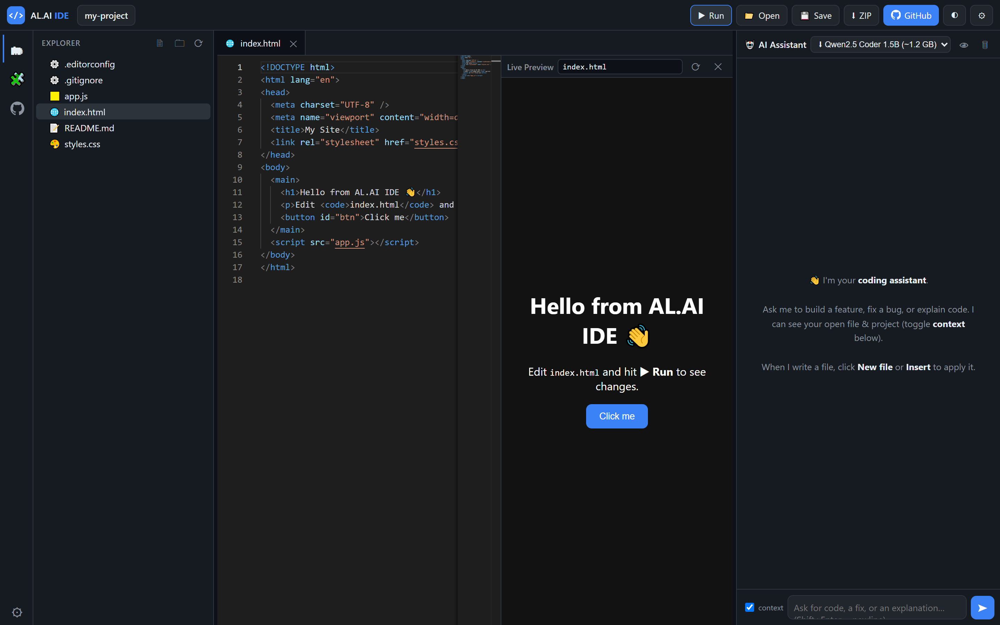
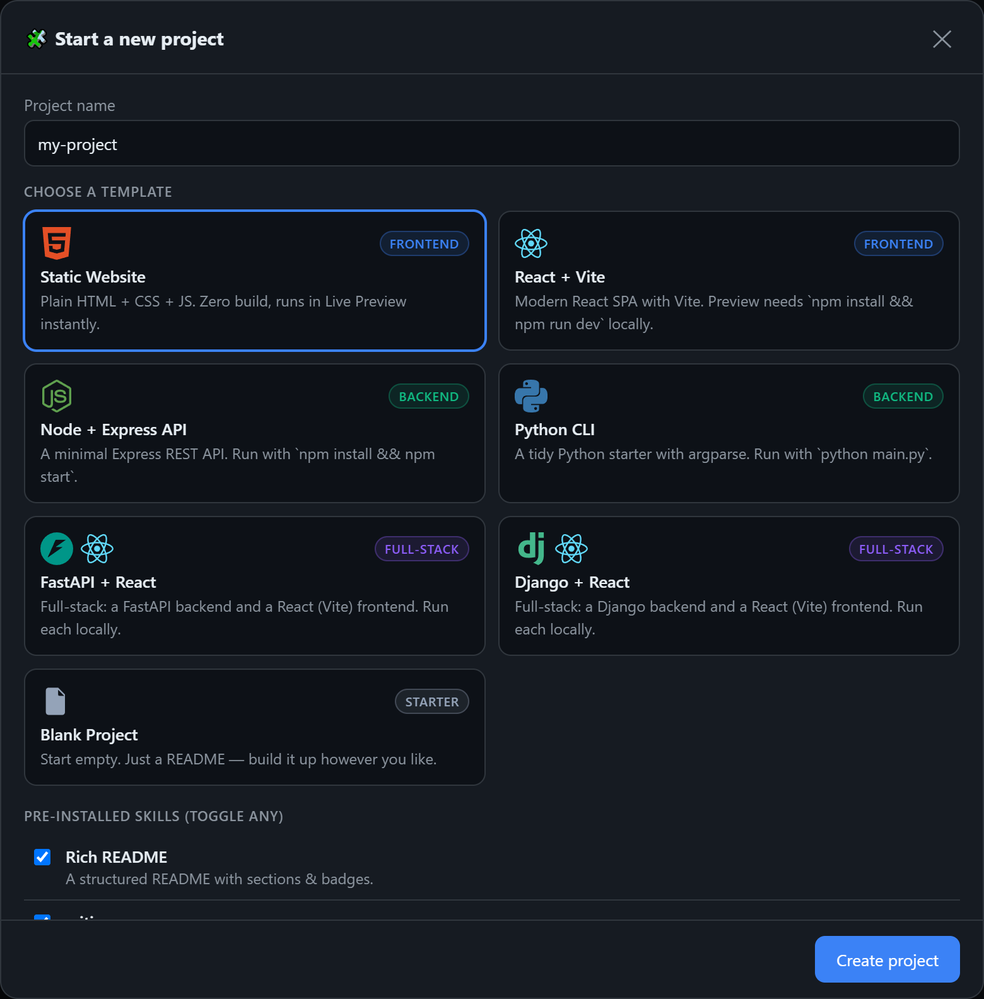

<div align="center">

# AL.AI IDE

**A serverless, browser-based AI web IDE.**
Build a project locally, edit it in a real Monaco editor, pair with an AI assistant that reads and
writes your files, preview it live, and export it as a ZIP or push it straight to GitHub.

[](LICENSE)

[Overview](#overview) · [Features](#features) · [What you can build](#what-you-can-build) · [Quick start](#quick-start) · [Deployment](#deployment) · [Architecture](#architecture) · [Contributing](#contributing)



</div>

---

## Overview

AL.AI IDE is a single-page web IDE that runs entirely in the browser. You build a project in a real
file tree (persisted in IndexedDB), edit it with the VS Code editor engine (Monaco), and work
alongside an AI coding assistant that reads your open file and project context and returns code you
can apply in one click.

Nothing is uploaded until you choose to push to GitHub. Your project lives in your browser and
survives reloads. You can run the app as a plain static site or deploy your own instance on Vercel.

- **No backend of ours** — the app is fully client-side; optional Edge functions only proxy a shared AI key.
- **Local-first** — files, chat history, and settings stay in your browser (IndexedDB / localStorage).
- **Zero build** — vanilla JavaScript modules; no bundler, no framework, no install step to run it.

---

## Features

### Editor
- Monaco editor (the engine behind VS Code): syntax highlighting for 25+ languages, minimap, multi-tab editing.
- Local file system: create, rename, and delete files and folders; drag-and-drop import from your OS.
- Autosave to the browser (IndexedDB) — reopen the tab and your project is intact.
- Open a real folder from disk (File System Access API) and save changes back to it.
- Export the entire project as a `.zip` at any time.

### AI coding assistant
- Curated free coding models — Qwen 2.5 Coder, DeepSeek V3/R1, Llama 3.3 70B, Gemini Flash — across
  OpenRouter, Groq, Google, and Cerebras, plus OpenRouter's live free-model list.
- Two-level automatic fallback: if a model is rate-limited or fails, it advances to the next provider/model.
- Context-aware: the assistant receives your open file and project file list (which you can toggle off).
- One-click apply: every returned code block offers *New file*, *Insert*, and *Copy*; a named target
  path writes straight to that file.
- Bring-your-own-key for any provider (stored only in your browser), or rely on a deployment's shared key.

### Templates and skills
- A start-up wizard to scaffold a project from a template, with optional "skills" (README, `.gitignore`,
  `.editorconfig`, Prettier, ESLint, MIT license, GitHub Actions, and Contributing / Code of Conduct /
  Security policy generators).
- Skills can also be added to an existing project from the Skills panel.

### Live preview
- Renders your project in a sandboxed iframe, rewriting relative asset links to blob URLs so multi-file
  HTML/CSS/JS sites run with no build and no server. Refreshes as you type.

### GitHub integration
- Connect with a fine-grained token (stored only in your browser — no OAuth secret, fully serverless).
- List, create, and select a repository, then push the whole project in one commit via the Git Data API,
  with a live per-file log.

---

## What you can build

The IDE application is **frontend-only** — there is no backend of ours. As a **project scaffolder**,
however, it generates both frontend and backend starters:

<div align="center">
  
</div>

| Template | Stack | Type | Live Preview |
|----------|-------|------|--------------|
| Static Website | HTML + CSS + JS | Frontend | Yes — instantly |
| React + Vite | React SPA | Frontend | Local (`npm run dev`) |
| Node + Express API | Express REST API | Backend | Local |
| Python CLI | Python + argparse | Backend | Local |
| FastAPI + React | FastAPI + React/Vite | Full-stack | Local (run each half) |
| Django + React | Django + React/Vite | Full-stack | Local (run each half) |
| Blank | Empty starter | — | — |

The in-browser Live Preview runs frontend/static projects in a sandboxed iframe. Backend and
full-stack templates are meant to be exported (ZIP or GitHub) and run locally — each ships with a
README containing the exact commands. The two full-stack templates wire a React (Vite) frontend to
their backend on `:8000` through a dev proxy, so both halves run same-origin during development with
no CORS configuration.

---

## Quick start

```bash
git clone https://github.com/alouatiq/AL.AI-IDE.git
cd AL.AI-IDE

# Serve as a static site (bring your own key in Settings):
npx serve .
# then open the printed http://localhost:<port>
```

Open the app through a local server (not the `file://` path — Monaco requires an `http(s)` origin).
Add a free provider key (for example from [openrouter.ai/keys](https://openrouter.ai/keys)) in
**Settings**, or deploy with a server key so visitors need no key of their own (see below).

---

## Deployment

[](https://vercel.com/new/clone?repository-url=https%3A%2F%2Fgithub.com%2Falouatiq%2FAL.AI-IDE)

1. Click the button (or run `vercel`).
2. Optionally add any of these environment variables so visitors need no key of their own:

   | Variable | Provider | Free key |
   |----------|----------|----------|
   | `OPENROUTER_API_KEY` | OpenRouter | <https://openrouter.ai/keys> |
   | `GROQ_API_KEY` | Groq | <https://console.groq.com/keys> |
   | `GEMINI_API_KEY` | Google Gemini | <https://aistudio.google.com/app/apikey> |
   | `CEREBRAS_API_KEY` | Cerebras | <https://cloud.cerebras.ai/> |

3. Redeploy. Vercel serves `index.html` statically and runs `api/*` as Edge functions.

Local development with the Edge functions:

```bash
cp .env.example .env.local   # add at least OPENROUTER_API_KEY
npx vercel dev
```

The app also works with zero server keys — it prompts each visitor to add their own in Settings.

---

## Architecture

```
Browser (index.html + assets/js/*)
   Left     file tree      VFS in IndexedDB (+ File System Access API, ZIP export)
   Middle   code editor    Monaco (from CDN)
   Right    AI assistant   your key -> provider directly
                           server key -> /api/chat (Edge function adds the secret)
   GitHub   push           api.github.com with your browser-only token
```

Provider key priority: **your own key (overrides) → shared server key → skip.** The Edge functions
are optional; they exist only to keep a shared server key secret. Without them, every feature still
works with bring-your-own-key.

### Tech stack

- Vanilla JavaScript (no framework, no build step), organised into small classic-script modules under one `IDE` namespace.
- [Monaco Editor](https://microsoft.github.io/monaco-editor/) (CDN) — the VS Code editing engine.
- [JSZip](https://stuk.github.io/jszip/) (CDN) — project export.
- IndexedDB and the File System Access API — local persistence and real-folder access.
- Vercel Edge Functions — optional serverless key proxy.
- GitHub REST / Git Data API — browser-side push.

---

## Project structure

```
AL.AI-IDE/
├── index.html            App shell (loads Monaco and all modules)
├── assets/
│   ├── css/app.css       All styling
│   └── js/               One module per concern (util, vfs, editor, explorer,
│                         preview, skills, ai, github, app) — see assets/js/README.md
├── api/                  Optional Vercel Edge functions (chat proxy, model list)
├── docs/                 Screenshots and design notes
└── .github/              CI/CD, Dependabot, issue and PR templates
```

Every directory contains its own `README.md` describing what lives there.

---

## Contributing

Contributions are welcome. This is a dependency-free, no-build app, which makes it easy to work on.
See [CONTRIBUTING.md](CONTRIBUTING.md) for setup and conventions and the
[Code of Conduct](CODE_OF_CONDUCT.md). Good first areas: new templates and skills, additional
languages, UI polish, and documentation.

## Security

See [SECURITY.md](SECURITY.md) to report a vulnerability. Keys and tokens live only in your browser;
a deployment's server keys stay in Vercel environment variables behind the Edge proxy.

## License

Released under the [MIT License](LICENSE).

## Contact

| | |
|---|---|
| Author | AL OUATIQ |
| Website | <https://alouatiq.com> |
| Email | <contact@alouatiq.com> |
| GitHub | [@alouatiq](https://github.com/alouatiq) |
