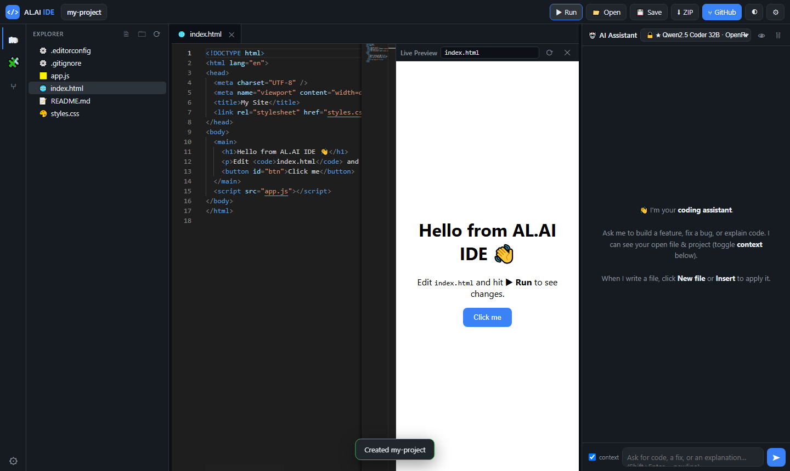

<h1 align="center">AL.AI IDE — Serverless AI Web IDE</h1>

<p align="center">
  A browser-based IDE that feels like VS Code, with the best <b>free</b> coding LLMs built right in.<br>
  Build a project locally, edit it in a real <b>Monaco</b> editor, chat with an AI that can read and write your files,
  preview it live, download it as a ZIP, or push it straight to <b>GitHub</b> — all with <b>no backend of ours</b>.
</p>

<p align="center">
  <a href="LICENSE"></a>
  
  
</p>

<p align="center">
  <a href="#-features">Features</a> ·
  <a href="#-quick-start">Quick start</a> ·
  <a href="#-deploy-your-own">Deploy</a> ·
  <a href="#-how-it-works">How it works</a> ·
  <a href="#-project-structure">Structure</a> ·
  <a href="#-contributing">Contributing</a>
</p>

---

## 📬 Contact

| | |
|---|---|
| **Author** | AL OUATIQ |
| **Website** | <https://alouatiq.com> |
| **Email** | contact@alouatiq.com |
| **GitHub** | [@alouatiq](https://github.com/alouatiq) |

---

## 🎯 What is this?

**AL.AI IDE** is a single-page, backendless web IDE. On the **left** you build a project locally
(a real file tree, persisted in your browser); in the **middle** you edit it with the actual VS Code
editor engine (**Monaco**); and on the **right** an **AI coding assistant** — powered by the best free
LLMs — reads your open file and project, and writes code you can apply with one click.

- **Nothing is uploaded** until *you* choose to push to GitHub.
- **Your project lives in your browser** (IndexedDB) and survives reloads.
- **Deploy your own** on Vercel in minutes, or run it as a plain static site.



---

## ✨ Features

### 🖥 A real IDE, in the browser
- **Monaco editor** (the engine behind VS Code) — syntax highlighting for 25+ languages, minimap, multi-tab editing.
- **Local file system** — create, rename, delete files & folders; drag-and-drop files/folders in from your OS.
- **Autosave** to the browser (IndexedDB). Reopen the tab and your project is still there.
- **Open a real folder** from disk (File System Access API) and **save changes back** to it.
- **Download the whole project as a `.zip`** any time.

### 🤖 AI coding assistant (best free models)
- **Curated coding models** ranked first — Qwen 2.5 Coder, DeepSeek V3/R1, Llama 3.3 70B, Gemini Flash — across
  **OpenRouter, Groq, Google & Cerebras** (all free tiers), plus OpenRouter's **live free-model list** merged in.
- **Two-level automatic fallback** — if a model is rate-limited or fails, it walks to the next provider/model.
- **Sees your code** — the AI gets your open file + project file list as context (toggle it off any time).
- **Apply with one click** — every code block the AI returns has **New file** / **Insert** / **Copy** buttons; when the
  AI names a target path (```` ```js src/app.js ````), it writes straight to that file.
- **Bring-your-own-key** — paste your own free key for any provider (stored only in your browser), or rely on the
  deployment's shared server key.

### 🧩 Skills & templates
- **Start-up wizard** — pick a template (Static site, React + Vite, Node + Express, Python CLI, Blank) and toggle
  **pre-selected skills** (README, `.gitignore`, `.editorconfig`, Prettier, ESLint, MIT license, GitHub Actions).
- Add skills to an existing project later from the **🧩 Skills** panel.

### 👁 Live preview
- **▶ Run** renders your project in a sandboxed iframe, rewriting relative asset links to blob URLs so multi-file
  HTML/CSS/JS sites work with **no build and no server**. Auto-refreshes as you type.

### ⑂ GitHub, from the browser
- **Connect with a fine-grained token** (stored only in your browser — fully serverless, no OAuth secret).
- **List, create and select** a repository, then **push the whole project in one commit** via the Git Data API.
- A guided push dialog with a live log of every file uploaded.

### 🔐 Privacy
- Project files, chat history and settings stay in **your browser**.
- The only outbound calls are to the **AI provider** you pick and, when you push, to **api.github.com**.

---

## 🚀 Quick start

```bash
git clone https://github.com/alouatiq/AL.AI-IDE.git
cd AL.AI-IDE

# Run as a static site (bring-your-own-key in ⚙ Settings):
npx serve .
# open the printed http://localhost:xxxx
```

> **Note:** open it through a local server (`npx serve .`), not the `file://` path — Monaco's editor engine
> needs an `http(s)` origin.

Then either add your own free key (e.g. [openrouter.ai/keys](https://openrouter.ai/keys)) in **⚙ Settings**, or deploy
with a server key so no key is needed (below).

---

## ☁️ Deploy your own

[](https://vercel.com/new/clone?repository-url=https%3A%2F%2Fgithub.com%2Falouatiq%2FAL.AI-IDE)

1. Click the button (or run `vercel`).
2. *(Optional)* add **any** of these Environment Variables so visitors need no key of their own:

   | Variable | Provider | Get a free key |
   |----------|----------|----------------|
   | `OPENROUTER_API_KEY` | OpenRouter (best free coding models) | <https://openrouter.ai/keys> |
   | `GROQ_API_KEY` | Groq (very fast) | <https://console.groq.com/keys> |
   | `GEMINI_API_KEY` | Google Gemini | <https://aistudio.google.com/app/apikey> |
   | `CEREBRAS_API_KEY` | Cerebras (very fast) | <https://cloud.cerebras.ai/> |

3. Redeploy. Vercel serves `index.html` statically and runs `api/*` as Edge functions.

**Local dev with the Edge functions:**
```bash
cp .env.example .env.local   # add at least OPENROUTER_API_KEY
npx vercel dev
```

The app also works with **zero** server keys — it just prompts each visitor to add their own in Settings.

---

## 🧠 How it works

```
Browser (index.html + assets/js/*)
   ├─ Left  · file tree ......... VFS in IndexedDB  (+ File System Access API, ZIP export)
   ├─ Middle· code editor ....... Monaco (from CDN)
   ├─ Right · AI assistant ...... your key → provider directly
   │                              server key → /api/chat (Edge fn adds the secret)
   └─ GitHub · push ............. api.github.com with your browser-only token
```

| Provider key priority | `your own key (overrides) → shared server key → skip` |
|---|---|

The four Edge functions are optional — they only exist to keep a shared server key secret. Without them, every
feature still works with bring-your-own-key.

---

## 📁 Project structure

```
AL.AI-IDE/
├── index.html            # app shell (loads Monaco + all modules)
├── assets/
│   ├── css/app.css       # all styling
│   └── js/               # one module per concern (util, vfs, editor, explorer,
│                         #   preview, skills, ai, github, app) — see assets/js/README.md
├── api/                  # optional Vercel Edge functions (chat proxy, model list)
├── docs/                 # screenshots & design notes
└── .github/              # CI/CD, Dependabot, issue/PR templates
```

Every directory has its own `README.md` explaining what lives there.

---

## 🛠 Tech stack

- **Vanilla JS** (no framework, no build step) organised into small classic-script modules under one `IDE` namespace.
- **[Monaco Editor](https://microsoft.github.io/monaco-editor/)** (CDN) — the VS Code editing engine.
- **[JSZip](https://stuk.github.io/jszip/)** (CDN) — project export.
- **IndexedDB** + **File System Access API** — local persistence and real-folder access.
- **Vercel Edge Functions** — optional serverless key proxy.
- **GitHub REST / Git Data API** — browser-side push.

---

## 🤝 Contributing

Contributions are welcome! It's a dependency-free, no-build app, so it's easy to hack on.
See **[CONTRIBUTING.md](CONTRIBUTING.md)**. Good first areas: new templates/skills, more languages, UI polish, docs.

---

## 🔒 Security

See **[SECURITY.md](SECURITY.md)** to report a vulnerability. Keys and tokens live only in your browser; the
deployment's server keys stay in Vercel env vars behind the Edge proxy.

---

## 📜 License

Released under the **[MIT License](LICENSE)** © 2026 AL OUATIQ.

<p align="center">
  <b>AL.AI IDE</b> · built by <a href="https://alouatiq.com">AL OUATIQ — ALOUATIQ.COM</a> · ⭐ Star it if it's useful!
</p>
